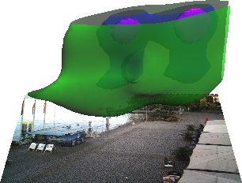
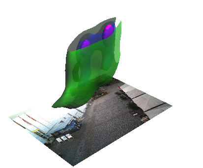
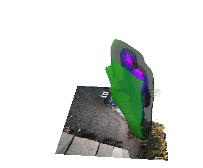

## amos-visualization
Experimenting with the analysis and visualization of density of people found in web camera images (project AMOS,  the Archive of Many Outdoor Scenes)

### Visualization examples
For comparison of Victoria Square before and after redesign, see [separate page](comparison_3760.md).

#### 2D kernel density
All observations are aggregated by the time of day. The color ramp is absolute for all animations to allow for comparison. 

#### 3D kernel density
3D kernel density of observations with Z coordinate as time of day (Space-Time Cube), visualized using multiple isosurfaces. All observations are aggregated by the time of day.

In these examples color means time of the day. We show only 1 isosurface.

From the figures we can quickly understand which time of the day the place gets busy. For example these places get busy towards the evening:

Here we can see less people during afternoon (perhaps siesta since it is in Italy and Spain):

Additional figures are [available here](https://drive.google.com/drive/u/0/folders/0B7CQoT4YE2mMYkc0a1Y2UWIyZ0E)

