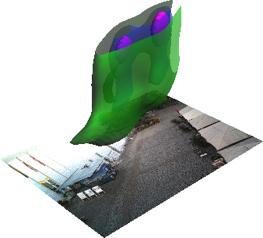

## amos-visualization
Experimenting with the analysis and visualization of density of people found in web camera images (project AMOS,  the Archive of Many Outdoor Scenes)

### Visualization examples

#### 2D kernel density
All observations are aggregated by the time of day. 

#### 3D kernel density
3D kernel density of observations with Z coordinate as time of day (Space-Time Cube), visualized using multiple isosurfaces. All observations are aggregated by the time of day.

